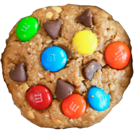

### Cookie Clicker 

# Objectifs :

**Projet de groupe javascript Aka Cookie Clicker**

[Liste des choses a faire](https://github.com/becodeorg/CRL-Woods-3.21/blob/master/LearningPath/02.The-Hill/11.Javascript/03.JS-Challenges/cookie-clicker/README.md)

1.  structure de base Rédigez la structure de base du projet en HTML, CSS et JavaScript. Dans le HTML, mettez un bouton clic qui incrémentera un compteur et une étiquette initialisée à 0 pour afficher ledit compteur.
2. préparer le JavaScript Dans votre JavaScript, préparez des variables pour vous permettre de contrôler votre bouton et votre étiquette. Vous aurez également besoin d'une variable pour suivre le score.
3.  augmenter le score Lorsque vous cliquez sur le bouton, augmentez de 1 la variable stockant le score, puis affichez le score actuel à l'intérieur de l'étiquette.
4.  créer un multiplicateur Ajoutez un autre bouton qui agira comme un multiplicateur. Lorsqu'il est appelé, ce bouton multipliera en permanence le nombre de points par clic, par deux par exemple.
5.  prix du multiplicateur Le multiplicateur vous permet d'avoir un gros score rapidement, cela ne devrait pas être gratuit, il devrait s'agir d'un achat effectué avec le score actuel du joueur.
6. pas de crédit Vous ne pouvez pas faire de crédit, ce qui signifie que le joueur ne peut pas avoir de score négatif. Pensez à mettre à jour l'affichage des scores après un achat.
7. affichage du compteur du multiplicateur Affichez le compteur dans le multiplicateur. Par exemple, si le compteur vaut 5, le bouton doit afficher quelque chose comme le multiplicateur x5.
8. augmenter le coût Acheter beaucoup de multiplicateur est bien trop facile. Pour plus de plaisir, faites en sorte que chaque fois qu'un multiplicateur est acheté, le coût d'achat d'un nouveau multiplicateur augmente.
9. afficher le coût Dans le texte du bouton multiplicateur, vous devriez également avoir le prix de la mise à niveau.
10. auto-clicker Implémentez une nouvelle amélioration à acheter, le auto-click. Comme son nom l'indique, ce bonus ajoutera automatiquement un clic à votre score toutes les x secondes.
11. bonus Mettez en œuvre une autre amélioration à acheter, le bonus. Cela devrait donner au joueur un bonus de 200% par clic pendant 30 secondes. Une fois acheté, le joueur devrait voir une minuterie avec le temps restant à l'intérieur du bouton bonus.
12. désactiver les boutons Faites en sorte que, si le joueur n'a pas les points pour acheter un multiplicateur, un auto-clic ou un autre bonus, il ne puisse pas.
13. rendez-le joli Votre cookie clicker doit être joli, faites-le bien paraître avec du CSS ou du JavaScript supplémentaire.

### Qu'est ce que c'est :

C'est un projet de groupe qui consiste a réliser une Cookie Clicker 

### Quand avons-nous travaillé dessus :

du 20/07/2020 au 22/07/2020

### Ou en sommes nous dans le projet :

mise en page ok ;) 

### Qui sommes nous  :

1. [Jean-Charles Brognez](https://github.com/jcbrognez)
2. [mohamed Shmayssany](https://github.com/M-Shmayssany)
3. [Adrien Delpire](https://github.com/osimers1)
4. [Robby Delvaux](https://github.com/Delvaux1986) 

